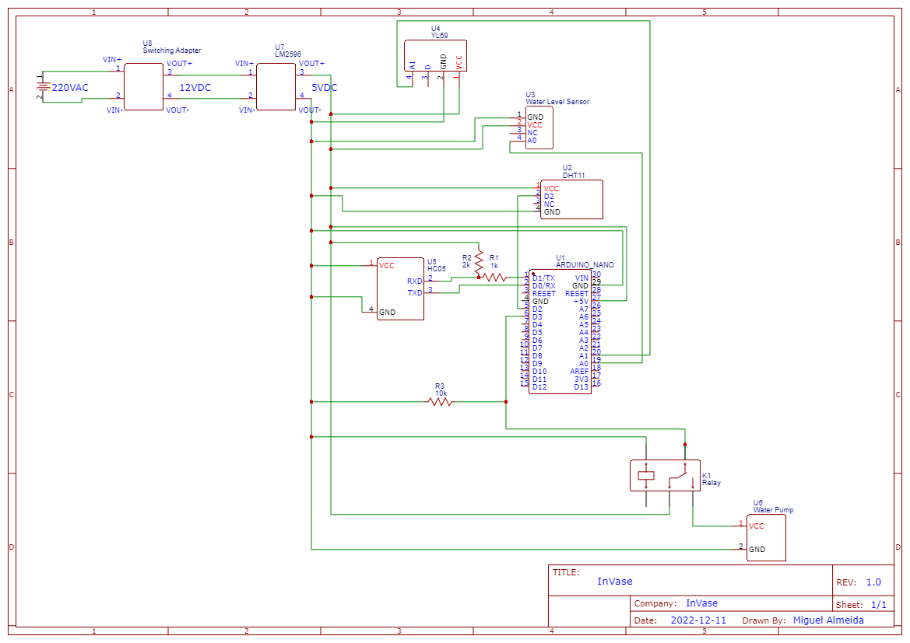

# InVase (v0.1)

An Arduino based smart vase system with real time monitoring and automatic irrigation.

## Material list

 - Arduino IDE
 - App for bluetooth communication & data display (app in repository was made in MIT App Inventor)
 - Arduino Nano
 - Temperature and humidity sensor - DHT11
 - Light sensor - LDR
 - Soil moisture sensor - YL69
 - Water level sensor
 - Vase with bottom
 - Water reservoir
 - Tube for water flow
 - Bluetooth module - JDY-34 (HC05)
 - Android smartphone
 - Mini water pump (3~6V)
 - Relay to control water pump
 - Breadboard
 - Resistors
 - Diode - 1N4007
 - Switching adapter 220VAC-12VDC
 - Buck Converter (step-down) - LM2596
 - Jumper wires

## Pinout & schematic

** A0 - Water level sensor output **
** A1 - Soil moisture sensor output **
** D2 - DHT11 (Temperature & humidity) output **
** D3 - Water pump (relay) output **

* Any transformer than can be coupled with a regulator to generate regulated 5V output can be used as power for the project.

* All sensors and components work on 5V power. They should all be connected to the same 5V line, provided by the step-down (regulator).

* A voltage divider composed of two resistors (1k, 2k ohms) is used on the RXD line of the bluetooth module (HC05). This is done to regulate the voltage on the line to its supported value, and allow the module to function correctly.

* A pull down resistor of 10k ohms is used to pull down the logic state of the D3 pin to LOW on startup. This is done to avoid the water pump from actuating immediately.

* The relay common pin should be connected to 5V. The normally open (NO) pin should be connected to the water pump VCC pin.

[Making of video](https://youtu.be/jraKmChVTTY)

## Authors

[Miguel Hirche](https://github.com/miguelha) (miguelhirchealmeida@gmail.com)

[Duarte Casal](https://github.com/Duarte99) (duartebraga1@outlook.pt)

## License

[MIT](https://choosealicense.com/licenses/mit/)